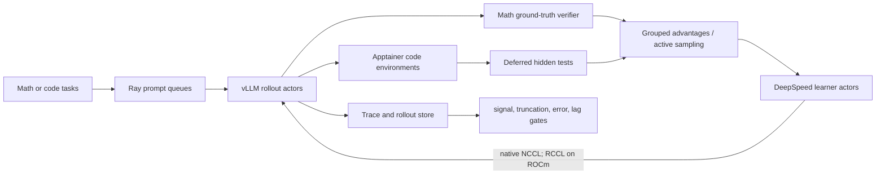

# oellm-rlvr

Standalone rollout and reinforcement-learning-with-verifiable-rewards control plane for OpenEuroLLM. It is designed for LUMI's AMD MI250X/ROCm environment first and uses the same configuration model on NVIDIA/CUDA clusters.

The repository deliberately does not copy a trainer. It pins the OpenEuroLLM TMAX/Open-Instruct backend at commit `3f80d37042402b8363f39c9535723b0d4cb8de54`, then owns the parts that need to be cluster- and project-specific:

- learner/rollout GPU topology validation;
- Slurm and multi-node Ray lifecycle;
- online vLLM rollout command generation and native learner-to-vLLM weight transfer;
- deterministic math verification;
- code-agent rollouts in Apptainer with seed files and deferred hidden tests;
- task packing, append-only trajectory schemas, and rollout health gates;
- ROCm and CUDA profiles using one control plane.

## How online training works



Math rows carry `messages` and `ground_truth`. Code rows carry `messages`, `tools`, and the backend's exact `env_config` structure. Code environments only receive seed files at reset; tests are uploaded when the agent submits, and `/logs/verifier/reward.txt` is clipped to `[0, 1]` by the backend.

## Local installation and checks

```bash
python3 -m venv .venv
.venv/bin/pip install -e '.[data,math,dev]'
.venv/bin/oellm-rlvr validate --config configs/lumi-math-qwen35-2b-smoke.yaml
.venv/bin/oellm-rlvr topology --config configs/lumi-code-qwen35-2b-smoke.yaml
.venv/bin/oellm-rlvr verify \
  --task examples/math_task.json \
  --completion examples/math_completion.txt
pytest
```

The standalone `CodeVerifier` defaults to Apptainer. Its local runner refuses to start without `--allow-unsafe-local`; local execution is only for trusted unit-test fixtures, never generated model code.

## LUMI quick start

These commands run on a LUMI login node. Replace paths only if your project layout differs.

```bash
ROOT=/scratch/project_465002530/users/bmoell
git clone git@github.com:BirgerMoell/oellm-rlvr.git "$ROOT/oellm-rlvr-src"
git clone https://github.com/OpenEuroLLM/tmax-reproduction.git "$ROOT/tmax-reproduction"
git -C "$ROOT/tmax-reproduction" checkout 3f80d37042402b8363f39c9535723b0d4cb8de54

bash "$ROOT/oellm-rlvr-src/scripts/bootstrap_lumi_env.sh" \
  "$ROOT/oellm-rlvr-src" \
  "$ROOT/tmax-reproduction" \
  "$ROOT/venvs/oellm-rlvr"
```

The bootstrap creates a `--system-site-packages` venv inside the current LUMI AI Factory ROCm 7 image. It adds Ray and the few missing Python packages without replacing LUMI's optimized PyTorch, vLLM, DeepSpeed, RCCL, or gfx90a kernels. Do not run the backend's normal `uv sync` on LUMI; that resolver includes CUDA-specific package sources.

Prepare a math smoke dataset and render a job:

```bash
VENV=$ROOT/venvs/oellm-rlvr
mkdir -p "$ROOT/oellm-rlvr/data"
$VENV/bin/oellm-rlvr make-math-smoke \
  --output "$ROOT/oellm-rlvr/data/math-smoke.parquet" --count 64
$VENV/bin/oellm-rlvr render-slurm \
  --config "$ROOT/oellm-rlvr-src/configs/lumi-math-qwen35-2b-smoke.yaml" \
  --output "$ROOT/oellm-rlvr/math-smoke.sbatch"
sbatch "$ROOT/oellm-rlvr/math-smoke.sbatch"
```

To reproduce the live Hugging Face sample smokes, download the pinned train shards and select eight
different semantic groups (enough to fill two asynchronous steps across four rollout engines):

```bash
mkdir -p data
curl -L \
  https://huggingface.co/datasets/birgermoell/oellm-math-rlvr/resolve/0ffc9d6dc82717c25733b3172f4dbd63e48bab68/data/train-00000-of-00001.parquet \
  -o data/oellm-math-rlvr-train.parquet
curl -L \
  https://huggingface.co/datasets/birgermoell/oellm-code-rlvr/resolve/e1cae7711049e3b5ff021fb3e9c752424882998c/data/train-00000-of-00001.parquet \
  -o data/oellm-code-rlvr-train.parquet
$VENV/bin/oellm-rlvr sample-math \
  --source data/oellm-math-rlvr-train.parquet \
  --output "$ROOT/oellm-rlvr/data/math-hf-0ffc9d6c-en-d5.parquet" \
  --count 8 --language en --min-difficulty 5 --diverse-by subdomain
$VENV/bin/oellm-rlvr sample-code \
  --source data/oellm-code-rlvr-train.parquet \
  --output-dir "$ROOT/oellm-rlvr/data/code-hf-e1cae771-s6" \
  --image "$ROOT/sandboxes/python-3.12-slim" \
  --count 8 --max-steps 6
```

The inputs are [birgermoell/oellm-math-rlvr](https://huggingface.co/datasets/birgermoell/oellm-math-rlvr)
and [birgermoell/oellm-code-rlvr](https://huggingface.co/datasets/birgermoell/oellm-code-rlvr).
`sample-math` retains the published ground truth and verifier metadata. `sample-code` exposes only the
problem to the policy and converts hidden `verification_info.test_cases` into sandbox-only test files.
The committed smoke profiles point at these generated paths.
The math smoke deliberately selects eight English difficulty-5 problems from different subdomains. Both
one-node profiles draw eight completions for each of four prompts, increasing the chance that the grouped
verifier rewards contain useful variation, and stop after one 32-episode optimization batch.
Active sampling and zero-standard-deviation filtering are disabled in these bounded smoke profiles so an
all-equal base-policy batch still exercises the learner and weight-sync path instead of resampling forever.
The code smoke uses a six-turn horizon, exposes turns remaining, and adds a final-step submission warning.
This lets a weak base policy reach the deferred verifier before exhausting the rollout token budget. Use
`--max-steps` to generate samples for a different rollout horizon, and keep `task.max_steps` in the run
configuration equal to that value.

Build the small read-only task sandbox once before the code smoke:

```bash
bash "$ROOT/oellm-rlvr-src/scripts/build_lumi_task_sandbox.sh" \
  "$ROOT/sandboxes/python-3.12-slim"
```

Use revision-labelled output paths when changing a sampled dataset. Hugging Face Datasets caches prepared
Arrow data by builder inputs and can otherwise reuse an older local Parquet build at the same pathname.

Prepare the included code smoke task:

```bash
$VENV/bin/oellm-rlvr pack-code \
  --manifest "$ROOT/oellm-rlvr-src/examples/code_task.yaml" \
  --output-dir "$ROOT/oellm-rlvr/data/code-smoke"
$VENV/bin/oellm-rlvr render-slurm \
  --config "$ROOT/oellm-rlvr-src/configs/lumi-code-qwen35-2b-smoke.yaml" \
  --output "$ROOT/oellm-rlvr/code-smoke.sbatch"
sbatch "$ROOT/oellm-rlvr/code-smoke.sbatch"
```

Before either job, cache the model and any Hugging Face dataset on shared storage because LUMI compute nodes have no internet access. The included profiles set the Hugging Face libraries to offline mode. The example code sandbox SIF path is intentionally project-local: build or copy a Python 3.12 SIF there, then update both the manifest and YAML if the path differs.

See [the LUMI runbook](docs/lumi.md), [architecture](docs/architecture.md), and [dataset/verifier contracts](docs/data-and-verifiers.md) for the full operating sequence.

## Profiles

| Profile | Purpose | GPU split |
|---|---|---|
| `lumi-math-qwen35-2b-smoke.yaml` | One-node math signal and weight-sync smoke | 4 learner + 4 rollout GCDs |
| `lumi-code-qwen35-2b-smoke.yaml` | One-node Slurm/Apptainer agent-test smoke | 4 learner + 4 rollout GCDs |
| `lumi-code-qwen35-2b-4node.yaml` | TMAX-style asynchronous code training | 16 learner + 16 rollout GCDs |
| `cuda-code-qwen35-2b-smoke.yaml` | NVIDIA port template | 4 learner + 4 rollout GPUs |

Every profile is validated before rendering. It rejects oversubscribed GPU layouts, insufficient rollout batches, invalid sequence-parallel divisibility, math runs with sandboxes, and code runs without sandboxes.

The LUMI profiles intentionally keep sequence parallelism at 1 because the pinned ROCm/FLA/Triton stack's
context-parallel GDN kernel fails AMD MLIR compilation for some variable rollout shapes. The learner GCDs are
used as data-parallel ranks instead; see the LUMI runbook before changing this setting.

## Definition of a successful smoke

The committed one-node profiles are bounded infrastructure smokes. A successful job is more than a zero
exit status:

1. every node passes the GPU/import/native-weight-transfer preflight;
2. all Ray nodes join and learner/vLLM placement groups are created;
3. rollouts and a learner step complete;
4. the initial and post-step weight broadcasts complete;
5. code runs show a sandbox reset, tool call, deferred test upload, and parsed reward;
6. response truncation, environment errors, and policy lag remain inside the configured gates.

Before scaling, run a separate signal qualification with active sampling enabled. It must contain both reward
0 and reward 1 within prompt groups, produce nonzero gradients, and remain inside the zero-standard-deviation
and policy-lag gates. The four-node training profile enables active sampling; do not scale a run with all-equal
rewards merely because the bounded infrastructure smoke passes.

The repository's local tests cover schemas, commands, packing, verifiers, gates, and Slurm rendering. The
one-node MI250X infrastructure smokes completed on LUMI on 2026-08-24; see
[the qualification record](docs/qualification-2026-08-24.md) for exact jobs, versions, metrics, and the
remaining signal-qualification work.

## Security

Generated code must run only in Apptainer/Docker sandboxes. Hidden tests must not appear in prompts, seed files, rollout traces, or model-visible tool output before submission. Use dedicated task images, read-only base images, bounded timeouts, no secrets, and no writable host bind beyond an isolated task workspace.

Apache-2.0 licensed.
