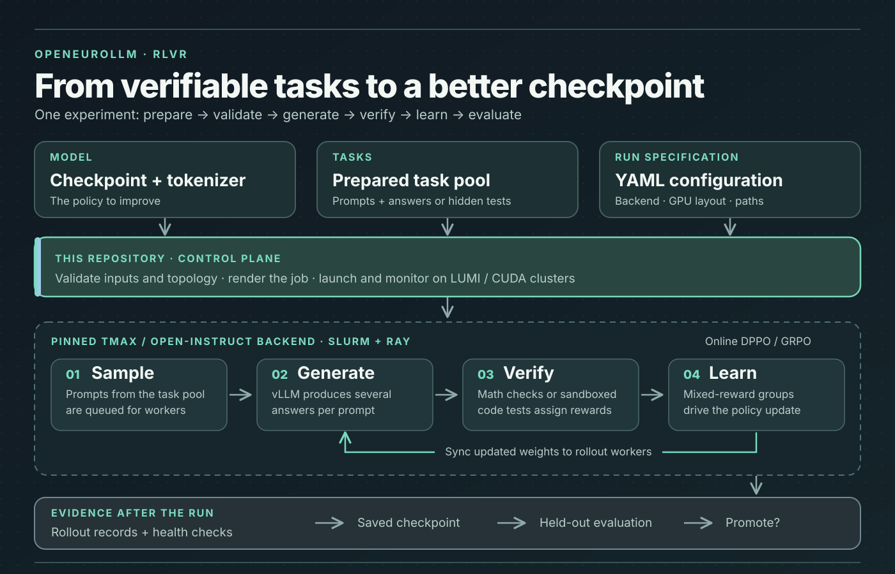

# oellm-rlvr



`oellm-rlvr` helps run reinforcement learning with verifiable rewards (RLVR) for OpenEuroLLM models. It is
built for LUMI's AMD MI250X GPUs first, with CUDA configurations for NVIDIA clusters. For math, a model
generates several answers per question, a deterministic verifier checks them, and the learner updates the
model from the resulting reward signal. Code tasks use isolated environments and hidden tests.

**Want to train a model? Start with [the first-run guide](docs/first-rl-run.md).** It covers the required
checkpoint and data, adapting a YAML configuration, validating and submitting a LUMI job, inspecting its
rollouts and gradients, and evaluating the new checkpoint. The [glossary](docs/first-rl-run.md#terms-used-in-this-repo)
explains terms such as *canary*, *promotion gate*, and *interface bridge*.

## What this repository provides

This is a control plane around pinned training backends, not a new RL trainer. It provides:

- Run configurations, GPU-topology checks, LUMI Slurm/Ray launch scripts, and checkpoint/restart handling.
- Math answer verification, code-task sandbox integration, rollout records, and health checks.
- Campaign descriptions and evaluation procedures to decide whether to continue from a checkpoint.
- An optional verl adapter for on-policy distillation; the first math run uses the pinned TMAX/Open-Instruct
  backend and does not require verl or the SkyRL–Harbor agentic stack.

The training loop is: **prepared tasks → model rollouts → deterministic rewards → learner update → weight
sync → checkpoint → independent evaluation**. A finished Slurm job is not itself proof that the model improved.
See [architecture](docs/architecture.md) for component boundaries and [data/verifier contracts](docs/data-and-verifiers.md)
for task formats and sandbox safety.

## Where to go next

| Goal | Read this |
|---|---|
| Run one bounded math RL job | [First-run guide](docs/first-rl-run.md) |
| Set up or troubleshoot LUMI | [LUMI runbook](docs/lumi.md) |
| Understand current proposed multilingual math training | [Math phase plan](docs/oellm9b-math-promotion-2026-09-28.md) |
| Train code or agentic tasks | [Data/verifier contracts](docs/data-and-verifiers.md), then [advanced reference](docs/advanced-run-reference.md) |
| Inspect completed experiments | [Experiment history](docs/experiment-history.md) and its dated qualification records |
| Explore future stages | [Progressive RL plan](docs/progressive-rl-runbook.md) |

Plans and YAML configurations are **not** claims that a job has run. [Experiment history](docs/experiment-history.md)
labels completed, failed, and proposed work separately. Do not submit an example configuration unchanged: its
account, input paths, and output paths may belong to a past run. Running `sbatch` allocates GPUs.

## Local validation (no GPU job)

```bash
python3 -m venv .venv
.venv/bin/pip install -e '.[data,math,dev]'
.venv/bin/oellm-rlvr validate --config configs/lumi-math-qwen35-2b-smoke.yaml
.venv/bin/oellm-rlvr topology --config configs/lumi-math-qwen35-2b-smoke.yaml
.venv/bin/pytest
```

These checks validate code and configuration. They do not test your LUMI container, staged model/data, or
training behavior. Follow the first-run guide for those steps.

Generated code must run in an isolated sandbox; hidden tests and secrets must never be exposed to the model.
Apache-2.0 licensed.
